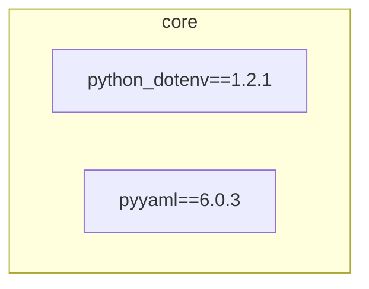

# conda-env-configs

> Infrastructure-as-code for reproducible Conda environments.

This repository defines all development environments used across projects as
versioned `environment.yml` files, with lightweight tooling for rebuilding and
auditing environments.

---

## 🎯 Goals

- Reproducible environments
- Explicit version pinning
- Minimal base environment
- Easy rebuilds
- Human-readable dependency intent
- Lightweight automation only
- Visual documentation via Mermaid

---

## 🧱 Environment Philosophy

Environments are treated like disposable containers:

- Create per project
- Keep small and intentional
- Delete and rebuild freely
- Never pollute `base`

---

## 📦 Dependency Ownership

Each project maintains its own `requirements.txt`.

This repository defines:

- Python version
- Conda channels
- How project dependencies are installed

All application dependencies must be edited in the project repository, not here.

Environment files reference project requirements directly:

pip:

- -r ../my-project/requirements.txt

---

## 🐍 Python Baseline

Default Python version:

```txt
python=3.10
```

Individual environments may override when required.

---

## 📂 Repository Layout

```txt
conda-envs/
├── base/ # Minimal tooling only
├── core/ # Shared dev stack
├── diagrams/ # Mermaid diagrams
├── template/ # New env template
├── tools/ # Bash automation
|
├── example_env/ # your created environments
└── test_env/ #
```

---

## ⚙️ Common Commands

### Build or update an environment

```bash
./tools/build.sh envname
```

---

### Rebuild an environment cleanly

```bash
./tools/rebuild.sh envname
```

---

## 📌 Version Pinning Rules

- Pin Python explicitly.

- Pin critical libraries exactly (ML, CUDA, ABI-sensitive).

- Use ranges for tooling and leaf libraries.

- Avoid committing fully locked transitive graphs to public repositories unless intentional.

---

## 🧹 Maintenance

Periodic cleanup:

### 1.

```sh
conda clean -a -y
```

This removes only cached and temporary artifacts.

| Category                    | What gets deleted             | Why it exists                   |
| --------------------------- | ----------------------------- | ------------------------------- |
| 📦 Package tarballs         | `.tar.bz2` and `.conda` files | Downloaded installers for reuse |
| 🧱 Extracted package caches | Unpacked package folders      | Speeds up env creation          |
| 🧪 Index caches             | Repo metadata                 | Faster package resolution       |
| 🗑️ Temp files               | Partial downloads             | Interrupted installs            |
| 🧠 Unused caches            | Old cache entries             | Disk bloat                      |

### 2.

```sh
pip cache purge
```

This deletes:

- Downloaded `.whl` files
- Source distributions (`.tar.gz`)
- Cached build wheels
- HTTP cache entries

### 3.

Audit environments:

```sh
conda env list
```

Delete unused environments.

---

# 🧱 base/environment.yml

> Minimal tooling only — no project dependencies.

```yaml
name: base
channels:
  - conda-forge
dependencies:
  - python=3.10
  - conda
  - pip
  - setuptools
  - wheel
```

---

# 📊 Environment-Dependencies Venn-Diagram

> Auto-generated on every commit.

<!-- DEP_GRAPH_START -->



<!-- DEP_GRAPH_END -->

---

# 🔐 Make Scripts Executable

Run once:

```bash
chmod +x tools/*.sh
```

---
